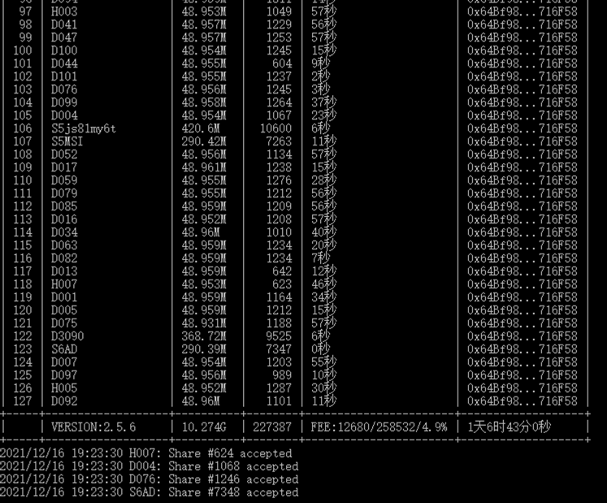
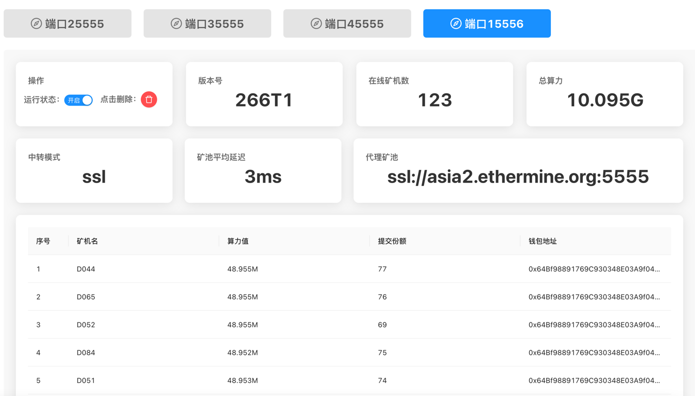
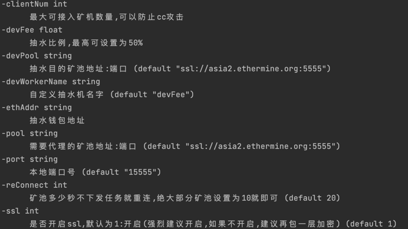

# MinerProxy-303


## 更新日志
```bigquery
2022-5-30 19:16    3.0.3>>>修复了内存溢出的问题,强烈建议3.0.X和2.6.X系列用户升级

目前的抽水方式为随机抽水,算力曲线不会像心电图那样,更加合理
2.5.5以上版本可以查看抽水的份额了(ps:当代理矿池和抽水矿池不一样时需要根据矿池算力自己算一下百分比)
```

## Liunx(建议centos系统最稳定)下

```bash
git clone https://github.com/minerProxy-eth/MinerProxy-303.git
cd MinerProxy-303 

```

### 后台运行（注意后面的&）运行完再敲几下回车

```bash
nohup ./MinerProxy -pool ssl://asia2.ethermine.org:5555 -port 15555 &
```

### 后台运行时关闭

```bash
killall MinerProxy
```
### 后台运行时查看
```bash
tail -f nohup.out
```
### 更新软件
```bash
git pull 
```
### 要运行多个代理矿池,设置不同的本地端口即可,例如

```bash
nohup ./minerProxy -pool ssl://asia2.ethermine.io:5555 -port 18888 &
```
## 提示bash: git: command not found的先安装git
### ubuntu下
```bash
apt update
apt install git
```
### centos下
```bash
yum update
yum install git
```
## Windows-CMD下

```bash
minerProxy.exe -pool ssl://asia2.ethermine.org:5555 -port 15555
```

---

# 参数说明


# 连接tcp矿池

```bash
./minerProxy -pool tcp://eth-hk.flexpool.io:4444
```

## 重要说明

```bigquery
推荐使用国际腾讯云香港节点,flexpool和ethermine都可以到50ms左右,延迟率在0.5%-0.9%之间
该软件系统占用极小,开最便宜的云服务器即可
可接定制软件
作者QQ：2177188143
```


